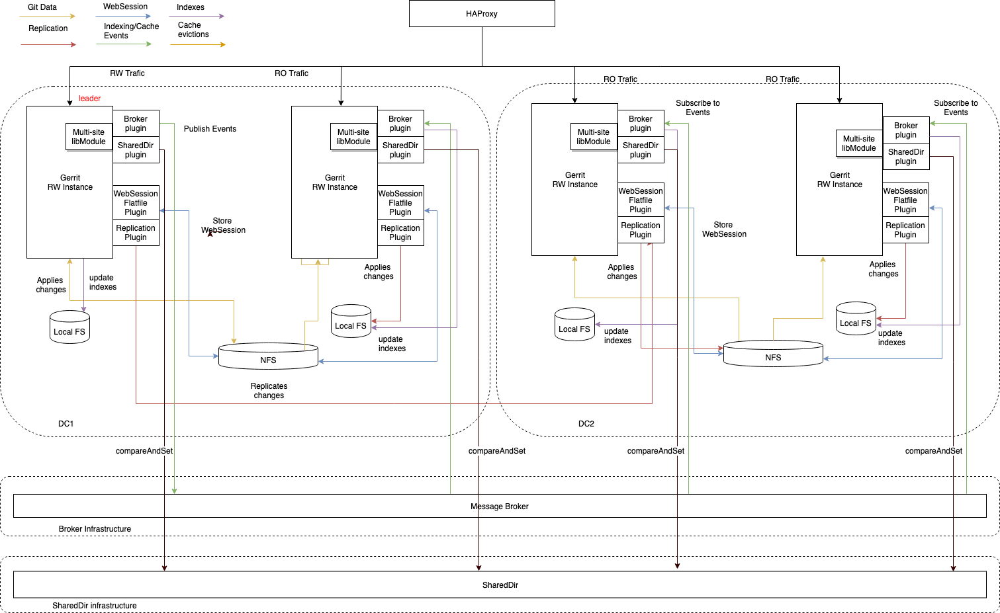
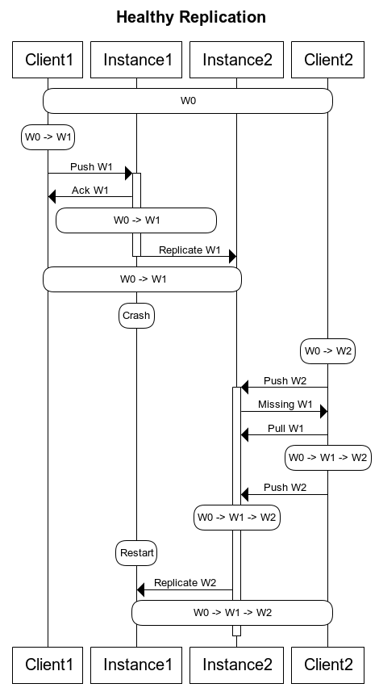
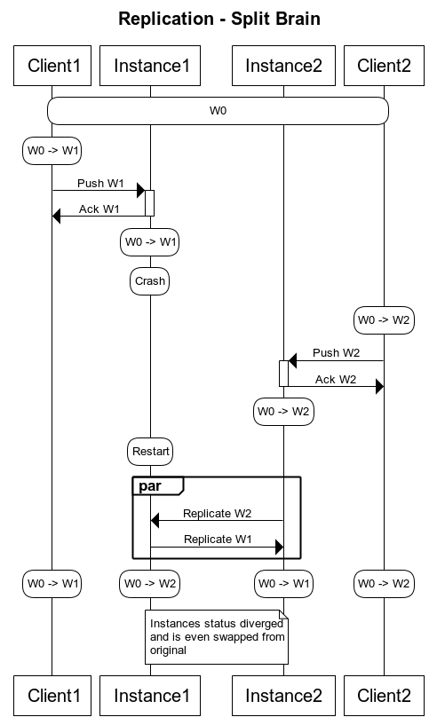
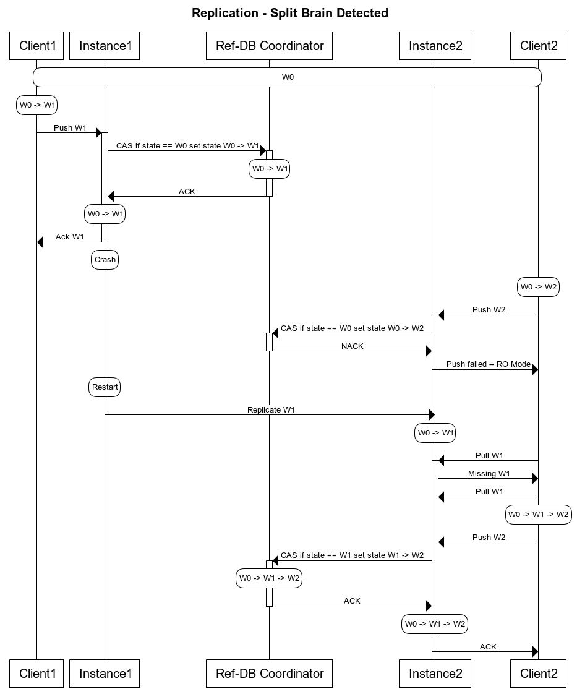

# Gerrit Multi-Site Plugin Design

This document collects and organizes thoughts about
the design of the Gerrit multi-site plugin,  supporting the definition of the
[implementation roadmap](#next-steps-in-the-roadmap).

It first presents background for the problems the plugin will address and
the tools currently available in the Gerrit ecosystem that support the
solution. It then lays out an overall roadmap for implementing support for Gerrit
multi-site, and a snapshot of the current status of the design including associated
limitations and constraints.

## Approaches to highly scalable and available Gerrit

Companies that adopt Gerrit as the center of their development and review
pipeline often have the requirement to be available on a 24/7 basis. This requirement
may extend across large and geographically distributed teams in different continents.

Because of constraints defined by the [CAP theorem](https://en.wikipedia.org/wiki/CAP_theorem)
designing a performant and scalable solution is a real challenge.

### Vertical scaling and high availability

Vertical scaling is one of the options to support a high load and a large number
of users.  A powerful server with multiple cores and sufficient RAM to
potentially fit the most frequently used repositories simplifies the design and
implementation of the system. The relatively reasonable cost of hardware and availability
of multi-core CPUs make this solution highly attractive to some large
Gerrit setups. Further, the central Gerrit server can be duplicated with an
active/passive or active/active high availability configuration with the storage of the
Git repositories shared across nodes through dedicated fibre-channel lines or
SANs.

This approach can be suitable for mid to large-sized Gerrit installations where
teams are co-located or connected via high-speed dedicated networks. However,
when teams are located on opposite sides of the planet, even at the speed of light
the highest theoretical fire-channel direct connection can be limiting.  For example,
from San Francisco to Bangalore the theoretical absolute minimum latency is 50
msec. In practice, however, it is often around 150/200 msec in the best case
scenarios.

### Horizontal scaling and multi-site

In the alternate option, horizontal scaling, the workload is spread
across several nodes, which are distributed to different locations.
For our teams in San Francisco and Bangalore, each accesses a
set of Gerrit masters located closer to their geographical location, with higher
bandwidth and lower latency. (To control operational cost from the proliferation of
servers, the number of Gerrit masters can be scaled up and down on demand.)

This solution offers a higher level of scalability and lower latency across locations,
but it requires a more complex design.

### Multi-master and multi-site, the best of both worlds

The vertical and horizontal approaches can be combined to achieve
both high performance on the same location and low latency across
geographically distributed sites.

Geographical locations with larger teams and projects can have a bigger
Gerrit server in a high availability configuration, while locations with
less critical service levels can use a lower-spec setup.

## Focus of the multi-site plugin

The  multi-site plugin enables the OpenSource version of Gerrit
Code Review to support horizontal scalability across sites.

Gerrit has already been deployed in a multi-site configuration at
[Google](https://www.youtube.com/watch?v=wlHpqfnIBWE) and in a multi-master fashion
at [Qualcomm](https://www.youtube.com/watch?v=X_rmI8TbKmY). Both implementations
include fixes and extensions that are tailored to the specific
infrastructure requirements of each company's global networks. Those
solutions may or may not be shared with the rest of the OpenSource Community.
Specifically, Google's deployment is proprietary and not suitable for any
environment outside Google's data-centers.  Further, in
Qualcomm's case, their version of Gerrit is a fork of v2.7.

In contrast, the multi-site plugin is based on standard OpenSource components and
is deployed on a standard cloud environment. It is currently used in a multi-
master and multi-site deployment on GerritHub.io, serving two continents (Europe
and North America) in a high availability setup on each site.

# The road to multi-site

The development of the multi-site support for Gerrit is complex and thus has
been deliberately broken down into incremental steps. The starting point is a
single Gerrit master deployment, and the end goal is a fully distributed set of
cooperating Gerrit masters across the globe.

1. 1x master / single location.
2. 2x masters (active/standby) / single location - shared disks
3. 2x masters (active/passive) / single location - shared disks
4. 2x masters (active RW/active RO) / single location - shared disks
5. 2x masters (active RW/active RO) / single location - separate disks
6. 2x masters (active RW/active RO) / active + disaster recovery location
7. 2x masters (active RW/active RO) / two locations
8. 2x masters (active RW/active RW) / two locations
9. 2 or more masters (active RW/active RW) sharded across 2 or more locations
10. Multiple masters (active RW/active RW) with quorum / multiple locations

The transition between steps requires not only an evolution of the Gerrit
setup and the set of plugins but also the implementation of more mature methods to
provision, maintain and version servers across the network. Qualcomm has
pointed out that the evolution of the company culture and the ability to consistently
version and provision the different server environments are winning features of
their multi-master setup.

Google is currently running at Stage #10.  Qualcomm is at Stage #4 with the
difference that both masters are serving RW traffic, which is possible because the specifics
of their underlying storage, NFS and JGit implementation allows concurrent
locking at the filesystem level. GerritHub is running at Stage #9, with 3 locations.

## Projects sharding

Having all the repositories replicated to all sites could be, in some cases, not
a great idea. The rationale can be explained with a simple example.

### The Tango secret project

Company FooCompany is developing a new huge and secret project code-named Tango
with a software engineering team all geo-located in India.
The Git repository is huge and contains millions of refs and packfiles for tens
of GBytes. Project Tango requires also to have some medium-sizes binaries in the
Git repository.
FooCompany has a multi-site deployment across the globe, covering Europe, USA,
Australia and China, other than India, where the new project is developed.

The teams in Europe and USA are involved in the project, from a code-review perspective.
Their engineers are typically using the Gerrit UI for reviews and fetch individual
patch-sets for local verification.

### Tango secret project, without sharding

All projects are replicated everywhere, including the Tango project.
The replication creates a huge network overload across the globe.

When an engineer is pushing a packfile in India, it gets replicated to all sites,
causing congestion on the replication channel.
When a software engineer in Europe reviews the changes of the Tango project, it
creates modifications to the NoteDb meta ref that would be then replicated back
to India with a non-neglibigle latency, due to the size of the repository and
the huge refs advertisement phase implied in the replication.

Software engineers around the globe do not need to see the Tango project, with
the exception of the reviewers in Europe and USA. However, everyone is impacted
and the servers and replication channels are overloaded.

### Tango secret local project, with sharding

The multi-site setup is using a sharding logic, projects are replicated
or not depending on how they are classified:

1. Global projects: category of projects that need to be always replicated to
   all sites. (Example: All-Projects and All-Users)
2. Local projects: category of projects that may not be replicated to
   all sites. (Example: the Tango project mentioned above)

The Tango project is a _local project_ because it is mainly developed in one
site: India.

When an engineer is pushing a packfile in India, it does not get replicated to
all sites, saving bandwidth for the global projects replication.
When a software engineer in Europe opens a change associated with the Tango project,
he gets silently redirected to the site in India where the project is located.

All sessions are broadcasted across the sites, so he does not realise that he is
in a different site. Gerrit assets are the same, CSS, JavaScript, Web components,
across all sites: the only thing that he may notice is a slight delay in the underlying
REST requests made by his browser.

Reviewers commenting on changes of the Tango project, create modifications to the NoteDb
in India, which are immediately visible to the local software engineers, without
a long replication lag.

Software engineers around the globe do not need to see the Tango project, with
the exception of the reviewers in Europe and USA. The Tango project is not visible
and not replicated to the other sites and, the people not involved in the project,
are not impacted at all.

## Pull replication, synchronous or asynchronous

Consider also pull replication for cases like 5, 6, 7... which could be done
also synchronously to the incoming write operation.
In case a write operation fails to be replicated by the master node(s), it could be
automatically rolled back and reported to the client for retry.
This would provide 100% loss-less disaster recovery support.

When running pull replication asynchronously, similarly to the replication plugin,
an unrecoverable crash of the replication source would result in unnoticed data loss.
The only way to recover the data would be telling the users who pushed the commits
to push them again. However, someone needs to manually detect the issue in the
replication log and get in touch with the user.

The [pull-replication plugin](https://gerrit.googlesource.com/plugins/pull-replication)
supports synchronous replication and has the structure to perform also the
asynchronous variant in the future.

## History and maturity level of the multi-site plugin

This plugin expands upon the excellent work on the high-availability plugin,
introduced by Ericsson for implementing mutli-master at Stage #4. The git log history
of this project still shows the 'branching point' where it started.
The v2.16.x (with NoteDb) of the multi-site plugin was at Stage #7.

The current version of the multi-site plugin is at Stage #9, it is now possible for
Gerrit data to be available in two or more separate geo-locations
(e.g. San Francisco, Frankfurt and Bangalore), each serving local traffic through
the local instances with minimum latency.

### Why another plugin from a high availability fork?

You may be questioning the reasoning behind
creating yet another plugin for  multi-master, instead of maintaining
a single code-base with the high-availability plugin. The choice stems from
the differing design considerations to address scalabiilty, as discussed above
for the vertical (single site) and horizonal (multi-site) approaches.

In theory, one could keep a single code-base to manage both approaches, however the
result would be very complicated and difficult to configure and install.
Having two more focused plugins, one for high availability and another for
multi-site, allows us to have a simpler, more usable experience, both for developers
of the plugin and for the Gerrit administrators using it.

The high-availability and multi-site plugins are solutions to different problems.
Two or more nodes on the same site are typically deployed to increase
the reliability and scalability of a Gerrit setup, however, doesn't provide any
benefit in terms of data access across locations. Replicating the repositories
to remote locations does not help the scalability of a Gerrit setup but is more
focused on reducing the data transfer time between the client and the server, thanks
to the higher bandwidth available in the local regions.

### Benefits

There are some advantages in implementing multi-site at Stage #9:

- Optimal latency of the Git read/write operations on all sites, and signficant
  improvement of the Gerrit UI responsiveness, thanks fo the reduction of the
  network latency.

- High SLA (99.99% or higher, source: GerritHub.io) can be achieved by
  implementing network distribution across sites.

- Access transparency through a single Gerrit URL, thanks to a geo-location DNS
  routing.

- Automatic failover, disaster recovery, and failover to remote sites.

- All sites have local consistency, with the assurance of global eventual
  consistency.

### Limitations

The current limitations of Stage #9 are:

- **Limited supports for many sites**:
  One could, potentially, support a very high number of sites, but the pull-replication
  logic to all sites could have a serious consequence in the overall perceived latency.
  Having to deal with a very high number of site requires the implementation of a quorum on
  all the nodes available for replication.

- **Requires Gerrit v3.0 or later**: Data consistency requires a server completely
  based on NoteDb.
  If you are not familiar with NoteDb, please read the relevant
  [section in the Gerrit documentation](https://gerrit-documentation.storage.googleapis.com/Documentation/3.0.12/note-db.html).

### Example of multi-site operations

Let's suppose you have two sites, in San Francisco and Bangalore. The
modifications of data will flow from San Francisco to Bangalore and the other way round.

Depending on the network infrastructure between the two sites latency can range
between seconds and minutes. The available bandwith is low, so the Gerrit admin
decides to use a traditional push replication (asynchronous) between the two sites.

When a developer located in Bangalore accesses a repository for which most pushes
originate from San Francisco, he may see a "snapshot in the past" of the data,
both from the Gerrit UI and on the Git repository served locally.
In contrast, a developer located in San Francisco will always see on his repository
the "latest and greatest" of everything.
Things are exactly the other way around for a repository that is mainly
receiving pushes from developers in Bangalore.

Should the central site in San Francisco become unavailable for a
significant period of time, the Bangalore site will still be able to serve all
Gerrit repositories, including those where most pushes come from San Francisco.
People in San Francisco can't access their local site anymore, because it is
unavailable. All the Git and Gerrit UI requests will be served remotely by the
Bangalore server while the local system is down. When the San Francisco site
comes up again, and passes the "necessary checks", it
will become the main site again for the users in the same geo location..

# Plugin design

This section goes into the high-level design of the current solution, lists
the components involved, and describes how the components interact with each other.

## What is replicated across Gerrit sites

There are several distinct classes of information that have to be kept
consistent across different sites in order to guarantee seamless operation of the
distributed system.

- **Git repositories**: They are stored on disk and are the most important
information to maintain.  The repositories store the following data:

  * Git BLOBs, objects, refs and trees.

  * NoteDb, including Groups, Accounts and review data

  * Project configurations and ACLs

  * Project submit rules

- **Indexes**: A series of secondary indexes to allow search and quick access
  to the Git repository data. Indexes are persistent across restarts.

- **Caches**: A set of in-memory and persisted data designed to reduce CPU and disk
  utilization and to improve performance.

- **Web Sessions**: Define an active user session with Gerrit, used to reduce
  load to the underlying authentication system.
  Sessions are stored by default on the local filesystem in an H2 table but can
  be externalized via plugins, like the WebSession Flatfile.

To achieve a Stage #9 multi-site configuration, all the above information must
be replicated transparently across sites.

## High-level architecture

The multi-site solution described here depends upon the combined use of different
components:

- **multi-site libModule**: exports interfaces as DynamicItems to plug in specific
implementation of `Brokers` and `Global Ref-DB` plugins.

- **broker plugin**: an implementation of the broker interface, which enables the
replication of Gerrit _indexes_, _caches_,  and _stream events_ across sites.
When no specific implementation is provided, then the [Broker Noop implementation](#broker-noop-implementation)
then libModule interfaces are mapped to internal no-ops implementations.

- **Global Ref-DB plugin**: an implementation of the Global Ref-DB interface,
which enables the detection of out-of-sync refs across gerrit sites.
When no specific implementation is provided, then the [Global Ref-DB Noop implementation](#global-ref-db-noop-implementation)
then libModule interfaces are mapped to internal no-ops implementations.

- **replication plugin**:This can be either the *replication plugin* which enables asynchronous push replication of the _Git repositories_,
  or the *pull replication plugin* which enables asynchronous pull replication of the _Git repositories_.
  As far as we're aware, most installations use *pull replication*.

- **web-session broker plugin**: supports the storage of _active sessions_
  to a message broker topic, which is then broadcasted across sites.

- **health check plugin**: supports the automatic election of the RW site based
  on a number of underlying conditions of the data and the systems.

- **HA Proxy**: provides the single entry-point to all Gerrit functionality across sites.

The interactions between these components are illustrated in the following diagram:



## Implementation Details

### Multi-site libModule

As mentioned earlier there are different components behind the overarching architecture
of this solution of a distributed multi-site gerrit installation, each one fulfilling
a specific goal. However, whilst the goal of each component is well-defined, the
mechanics on how each single component achieves that goal is not: the choice of which
specific message broker or which Ref-DB to use can depend on different factors,
such as scalability, maintainability, business standards and costs, to name a few.

For this reason the multi-site component is designed to be explicitly agnostic to
specific choices of brokers and Global Ref-DB implementations, and it does
not care how they, specifically, fulfill their task.

Instead, this component takes on only two responsibilities:

* Wrapping the GitRepositoryManager so that every interaction with git can be
verified by the Global Ref-DB plugin.

* Exposing DynamicItem bindings onto which concrete _Broker_ and a _Global Ref-DB_
plugins can register their specific implementations.
When no such plugins are installed, then the initial binding points to no-ops.

* Detect out-of-sync refs across multiple gerrit sites:
Each change attempting to mutate a ref will be checked against the Ref-DB to
guarantee that each node has an up-to-date view of the repository state.

### Message brokers plugin
Each gerrit node in the cluster needs to be informed and inform all other nodes
about fundamental events, such as indexing of new changes, cache evictions and
stream events. This component will provide a specific pub/sub broker implementation
that is able to do so.

When provided, the message broker plugin will override the dynamicItem binding exposed
by the multi-site module with a specific implementation, such as Kafka, RabbitMQ, NATS, etc.

#### Broker Noop implementation
The default `Noop` implementation provided by the `Multi-site` libModule does nothing
upon publishing and producing events. This is useful for setting up a test environment
and allows multi-site library to be installed independently from any additional
plugins or the existence of a specific broker installation.
The Noop implementation can also be useful when there is no need for coordination
with remote nodes, since it avoids maintaining an external broker altogether:
for example, using the multi-site plugin purely for the purpose of replicating the Git
repository to a disaster-recovery site and nothing else.

### Global Ref-DB plugin
Whilst the replication plugin allows the propagation of the Git repositories across
sites and the broker plugin provides a mechanism to propagate events, the Global
Ref-DB ensures correct alignment of refs of the multi-site nodes.

It is the responsibility of this plugin to store atomically key/pairs of refs in
order to allow the libModule to detect out-of-sync refs across multi sites.
(aka split brain).  This is achieved by storing the most recent `sha` for each
specific mutable `refs`, by the usage of some sort of atomic _Compare and Set_ operation.

We mentioned earlier the [CAP theorem](https://en.wikipedia.org/wiki/CAP_theorem),
which in a nutshell states that a distributed system can only provide two of these
three properties: _Consistency_, _Availability_ and _Partition tolerance_: the Global
Ref-DB helps achieving _Consistency_ and _Partition tolerance_ (thus sacrificing
Availability).

See [Prevent split brain thanks to Global Ref-DB](#prevent-split-brain-thanks-to-global-ref-db)
For a thorough example on this.

When provided, the Global Ref-DB plugin will override the dynamicItem binding
exposed by the multi-site module with a specific implementation, such as Zoekeeper,
etcd, MySQL, Mongo, etc.

#### Global Ref-DB Noop implementation

The default `Noop` implementation provided by the `Multi-site` libModule accepts
any refs without checking for consistency. This is useful for setting up a test environment
and allows multi-site library to be installed independently from any additional
plugins or the existence of a specific Ref-DB installation.

### Eventual consistency on Git, indexes, caches, and stream events

The replication of the Git repositories, indexes, cache and stream events happen
on different channels and at different speeds. Git data is typically larger than
meta-data and has higher latency than reindexing, cache evictions or stream
events. This means that when someone pushes a new change to Gerrit on one site,
the Git data (commits, BLOBs, trees, and refs) may arrive later than the
associated reindexing or cache eviction events.

It is, therefore, necessary to handle the lack of synchronization of those
channels in the multi-site plugin and reconcile the events at the destinations.

The solution adopted by the multi-site plugin supports eventual consistency at
rest at the data level, thanks to the following two components which:

* **Identify not-yet-processable events**: 
A mechanism to recognize _not-yet-processable events_ related to data not yet
available (based on the timestamp information available on both the metadata
update and the data event)

* **Queue not-yet-processable events**: 
A queue of *not-yet-processable events* and an *asynchronous processor*
to check if they became processable. The system also is configured to discard
events that have been in the queue for too long.

### Avoid event replication loops

Stream events are wrapped into an event header containing a source identifier.
Events originated by the same node in the broker-based channel are silently
dropped so that they do not replicate multiple times.

Gerrit has the concept of **server-id** which, unfortunately, does not help
solve this problem because all the nodes in a Gerrit cluster must have the same
server-id to allow interoperability of the data stored in NoteDb.

The multi-site plugin introduces a new concept of **instance-id**, which is a UUID
generated during startup and saved into the data folder of the Gerrit site. If
the Gerrit site is cleared or removed, a new id is generated and the multi-site
plugin will start consuming all events that have been previously produced.

The concept of the instance-id is very useful. Since other plugins could benefit
from it, it will be the first candidate to move into the Gerrit core,
generated and maintained with the rest of the configuration.  Then it can be
included in **all** stream events, at which time the multi-site plugin's
"enveloping of events" will become redundant.

### Manage failures

The broker based solution improves the resilience and scalability of the system.
But there is still a point of failure: the availability of the broker itself. However,
using the broker does allow having a high-level of redundancy and a multi-master
/ multi-site configuration at the transport and storage level.

At the moment, the acknowledge level for publication can be controlled via
configuration and allows to tune the QoS of the publication process. Failures
are explicitly not handled at the moment; they are just logged as errors.
There is no retry mechanism to handle temporary failures.

### Avoid Split Brain

The current solution of multi-site at Stage #7 with asynchronous replication
risks that the system will reach a Split Brain situation (see
[issue #10554](https://bugs.chromium.org/p/gerrit/issues/detail?id=10554)).

#### The diagram below illustrates the happy path with crash recovery returning the system to a healthy state.



In this case we are considering two different clients each doing a `push` on top of
the same reference. This could be a new commit in a branch or the change of an existing commit.

At `t0`: both clients see the status of `HEAD` being `W0`. `Instance1` is the
RW node and will receive any `push` request. `Instance1` and `Instance2` are in sync
at `W0`.

At `t1`: `Client1` pushes `W1`. The request is served by `Instance1` which acknowledges it
and starts the replication process (with some delay).

At `t2`: The replication operation is completed. Both instances are in a consistent state
`W0 -> W1`. `Client1` shares that state but `Client2` is still behind.

At `t3`: `Instance1` crashes.

At `t4`: `Client2` pushes `W2` which is still based on `W0` (`W0 -> W2`).
The request is served by `Instance2` which detects that the client push operation was based
on an out-of-date starting state for the ref. The operation is refused. `Client2`
synchronises its local state (e.g. rebases its commit) and pushes `W0 -> W1 -> W2`.
That operation is now considered valid, acknowledged and put in the replication queue until
`Instance1` becomes available.

At `t5`: `Instance1` restarts and is replicated at `W0 -> W1 -> W2`

#### The Split Brain situation is illustrated in the following diagram.



In this case the steps are very similar except that `Instance1` fails after acknowledging the
push of `W0 -> W1` but before having replicated the status to `Instance2`.

When in `t4` `Client2` pushes `W0 -> W2` to `Instance2`, this is considered a valid operation.
It gets acknowledged and inserted in the replication queue.

At `t5` `Instance1` restarts. At this point both instances have pending replication
operations. They are executed in parallel and they bring the system to divergence.

Root causes of the Split Brain problem:
- The RW node acknowledges a `push` operation before __all__ replicas are fully in sync.
- The other instances are not aware that they are out of sync.

Two possible approaches to solve the Split Brain problem:

- **Synchronous replication**: In this case the system would behave essentially as the
_happy path_ diagram shown above and would solve the problem by operating on the first of the causes,
at the expense of performance, availability and scalability. It is a viable and simple solution
for two nodes set up with an infrastructure allowing fast replication.

- **Centralise the information about the latest status of mutable refs**: This would operate
on the second cause. That is, it would allow instances to realise that _they are
not in sync on a particular ref_ and refuse any write operation on that ref.
The system could operate normally on any other ref and also would impose no
limitation in other functions such as, Serving the GUI, supporting reads, accepting new
changes or patch-sets on existing changes. This option is discussed in further
detail below.

**NOTE**: The two options are not exclusive.

#### Prevent split brain thanks to Global Ref-DB

The above scenario can be prevented by using an implementation of the Global Ref-DB
interface, which will operate as follows:



The difference, in respect to the split brain use case, is that now, whenever a change of a
_mutable ref_ is requested, the Gerrit server verifies with the central RefDB that its
status __for this ref__ is consistent with the latest cluster status. If that is true
the operation succeeds. The ref status is atomically compared and set to the new status
to prevent race conditions.

In this case `Instance2` enters a Read Only mode for the specific branch
until the replication from `Instance1` is completed successfully. At this point write
operations on the reference can be recovered.
If `Client2` can perform the `push` again vs `Instance2`, the server recognises that
the client status needs an update, the client will `rebase` and `push` the correct status.

__NOTE__:
This implementation will prevent the cluster to enter split brain but might result in a
set of refs in Read Only state across all the cluster if the RW node is failing after having
sent the request to the Ref-DB but before persisting this request into its `git` layer.

#### Geo located Gerrit master election

Once you go multi-site multi-master you can improve the latency of your calls by
serving traffic from the closest server to your user.

Whether you are running your infrastructure in the cloud or on premise you have different solutions you can look at.

##### AWS

Route53 AWS DNS service offers the opportunity of doing [Geo Proximity](https://docs.aws.amazon.com/Route53/latest/DeveloperGuide/routing-policy.html#routing-policy-geoproximity)
routing using [Traffic Flow](https://docs.aws.amazon.com/Route53/latest/DeveloperGuide/traffic-flow.html).

Traffic flow is a tool which allows the definition of traffic policies and rules via a UI. Traffic rules are of different types, among which *Geoproximity* rules.

When creating geoproximity rules for your resources you can specify one of the following values for each rule:

* If you're using AWS resources, the AWS Region that you created the resource in
* If you're using non-AWS resources, the latitude and longitude of the resource.

This allows you to have an hybrid cloud-on premise infrastructure.

You can define quite complex failover rules to ensure high availability of your system ([here](https://pasteboard.co/ILFSd5Y.png) an example).

Overall the service provided is pretty much a smart reverse-proxy, if you want more
complex routing strategies you will still need a proper Load Balancer.

##### GCE

GCE [doesn't offer](https://cloud.google.com/docs/compare/aws/networking#dns) a Geographical based routing, but it implicitly has geo-located DNS entries
when distributing your application among different zones.

The Load Balancer will balance the traffic to the [nearest available instance](https://cloud.google.com/load-balancing/docs/backend-service#backend_services_and_regions)
, but this is not configurable and the app server has to be in GC.

Hybrid architectures are supported but would make things more complicated,
hence this solution is probably worthy only when the Gerrit instances are running in GC.

##### On premise

If you are going for an on premise solution and using HAProxy as Load Balancer,
it is easy to define static ACL based on IP ranges and use them to route your traffic.

This [blogpost](https://icicimov.github.io/blog/devops/Haproxy-GeoIP/) explains how to achieve it.

On top of that, you want to define a DNS entry per zone and use the ACLs you just defined to
issue redirection of the calls to most appropiate zone.

You will have to add to your frontend definition your redirection strategy, i.e.:

```
http-request redirect code 307 prefix https://review-eu.gerrithub.io if acl_EU
http-request redirect code 307 prefix https://review-am.gerrithub.io if acl_NA
```

# Next steps in the roadmap

## Move to multi-site Stage #10.

- Auto-reconfigure HAProxy rules based on the projects sharding policy

- Implement more global-refdb storage layers (e.g. TiKV) and more cloud-native
  message brokers (e.g. NATS)

- Implement a quorum-based policy for accepting or rejecting changes in the pull-replication
  plugin

- Allow asynchronous pull-replication across sites, based on asynchronous events through
  the message broker

- Implement a "fast replication path" for NoteDb-only changes, instead of relying on the
  Git protocol
