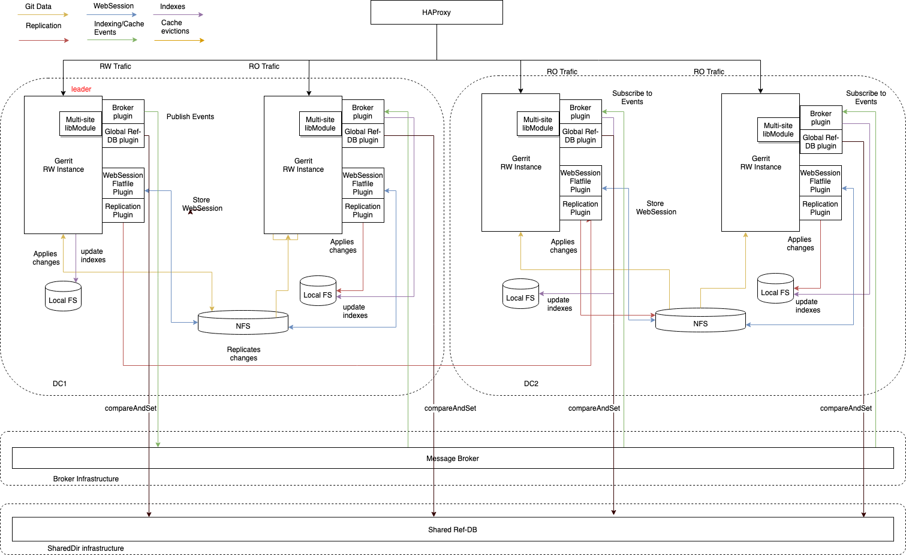

# Gerrit Multi-Site Plugin Design

This document aims at helping in collecting and organizing the thoughts about
the design of the Gerrit multi-site plugin and supporting the definition of the
[implementation roadmap](#next-steps-in-the-road-map).

It starts presenting a background of the problem that is trying to address and
the tools currently available in the Gerrit ecosystem that helps to support the
solution. It then gives an overall roadmap of the support for Gerrit
multi-site and a snapshot of the current status of the design and its associated
limitations and constraints.

## Approaches to highly scalable and available Gerrit

Offering a highly available and scalable service is a challenging problem. There
are trade-offs to be made because of the constraints defined by the
[CAP theorem](https://en.wikipedia.org/wiki/CAP_theorem), and therefore designing a
performant and scalable solution is a real challenge.

Companies that adopt Gerrit as the center of their development and review
pipeline often have the requirement to be available on a 24/7 basis and possibly
serving large and geographically distributed teams in different continents.

### Vertical scaling and high-availability

Vertical scaling is one of the options to support a high load and a large number
of users.  Having a big powerful server with multiple cores and plenty of RAM to
potentially fit the most frequently used repositories simplifies the design and
implementation of the system. Nowadays the cost of hardware and the availability
of multi-core CPUs have made this solution highly attractive to some large
Gerrit setups. The central Gerrit server can also be duplicated with an
active/passive or active/active high-availability setup where the storage of the
Git repositories is shared across nodes through dedicated fibre-channel lines or
SANs.

This approach can be suitable for mid to large-sized Gerrit Installations where
teams are co-located or connected via high-speed dedicated networks. However,
then teams can be located on the other side of the planet, the speed of light
would still limit the highest theoretical fire-channel direct connection (e.g.,
from San Francisco to Bangalore the  theoretical absolute minimum latency is 50
msec, but in practical terms, it is often around 150/200 msec in the best case
scenarios).

### Horizontal scaling and multi-site

One alternative approach is horizontal scaling, where the workload can be spread
across several nodes distributed to different locations. This solution offers a
higher level of scalability and lower latency across locations but requires
a more complex design.

Two teams located one in San Francisco and the other in Bangalore would access a
set of Gerrit masters located closer to their geographical position, with higher
bandwidth and lower latency. The number of Gerrit masters can be scaled up and
down on-demand, reducing the potential operational costs due to the
proliferation of multiple servers.

### Multi-master and multi-site, the best of both worlds

The vertical and horizontal approaches can be also combined together to achieve
both high performances on the same location and low latency across
geographically distributed sites.

The geographical locations with larger teams and projects can have a bigger
Gerrit server in a high-availability configuration, while the ones that have
less critical service levels can use a lower-spec setup.

## Focus of the multi-site plugin

The  multi-site plugin is intended to enable the  OpenSource version of Gerrit
Code Review code-base to support horizontal scalability across sites.

Gerrit has been already been deployed in a multi-site configuration at
[Google](https://www.youtube.com/watch?v=wlHpqfnIBWE) and a multi-master fashion
at [Qualcomm](https://www.youtube.com/watch?v=X_rmI8TbKmY). Both implementations
included fixes and extensions that were focussed in addressing the specific
infrastructure requirements of the Google and Qualcomm global networks. Those
requirements may or may not be shared with the rest of the OpenSource Community.

Qualcomm's version of Gerrit is a fork of v2.7, Google's deployment is
proprietary and would not be suitable for any environment outside the Google's
data-centers.

The multi-site plugin, instead, is based on standard OpenSource components and
is deployed on a standard cloud environment. It is currently used in a multi-
master and multi-site deployment on GerritHub.io, serving two continents (Europe
and Americas) in a high-availability setup on each site.

# The road to multi-site

The development of the multi-site support for Gerrit is complex and thus has
been deliberately broken down into incremental steps. The starting point is a
single Gerrit master deployment, and the end goal is a fully distributed set of
cooperating Gerrit masters across the globe.

1. 1x master / single location.
2. 2x masters (active/standby) / single location - shared disks
3. 2x masters (active/passive) / single location - shared disks
4. 2x masters (active RW/active RO) / single location - shared disks
5. 2x masters (active RW/active RO) / single location - separate disks
6. 2x masters (active RW/active RO) / active + disaster recovery location
7. 2x masters (active RW/active RO) / two locations
8. 2x masters (active RW/active RW) sharded / two locations
9. 3x masters (active RW/active RW) sharded with auto-election / two locations
10. Multiple masters (active RW/active RW) with quorum / multiple locations

The transition between steps does require not only an evolution of the Gerrit
setup and the set of plugins but also a different maturity level in the way the
servers are provision, maintained and versioned across the network. Qualcomm
pointed out the evolution of the company culture and the ability to consistently
version and provision the different server environments as a winning factor of
their multi-master setup.

Google is currently running at stage #10, Qualcomm is at stage #4 with the
difference that both masters are serving RW traffic, due to the specifics
of their underlying storage, NFS and JGit implementation that allows concurrent
locking at filesystem level.

## History and maturity level of the multi-site plugin

This plugin is coming from the excellent work on the high-availability plugin,
introduced by Ericsson for solving a mutli-master at stage #4. The git log history
of this projects still shows the 'branching point' on where it started.

The current version of the multi-site plugin is at stage #7, which is a pretty
advanced stage in the Gerrit multi-master/multi-site configuration.

Thanks to the multi-site plugin, it is possible to have Gerrit configured and
available in two separate geo-locations (e.g. San Francisco and Bangalore),
where both of them are serving local traffic through the local instances with
minimum latency.

### Why another plugin from a high-availability fork?

By reading this design document you may be wondering the reason behind
creating yet another plugin for solving multi-master instead of just keeping
a single code-base with the high-availability plugin.
The reason can be found in the initial part of design that described the two
different approaches to scalability: vertical (single site) and horizonal (multi-site).

You could in theory keep a single code-base to manage both of them, however the
result would have been very complicated and difficult to configure and install.
Having two more focussed plugins, one for high-availability and another for
multi-site, would allow to have a simpler and more usable experience for developers
of the plugin and for the Gerrit administrators using it.

### Benefits

There are some advantages in implementing multi-site at stage #7:

- Optimal latency of the read-only operations on both sites, which makes around 90%
  of the Gerrit traffic overall.

- High SLA (99.99% or higher, source: GerritHub.io) due to the possibility of
  implementing both high-availability inside the local site and automatic site
  failover in case of a catastrophe in one of the two sites.

- Transparency of access through a single Gerrit URL entry-point.

- Automatic failover, disaster recovery and leader re-election.

- The two sites have local consistency and, on a global level, eventual consistency.

### Limitations

The current limitations of stage #7 are:

- Only one of the two sites can be RW and thus accepting modifications on the
  Git repositories or the review data.

- It can easily support only two sites.
  You could potentially use it for more sites, however the configuration
  and maintenance efforts are more than linear to the number of nodes.

- Switch between the RO to RW site is defined by a unique decision point, which
  is a Single-Point-of-Failure

- Lack of transactionality between sites.
  Data written to one site is acknowledged
  before its replication to the other location.

- The solution requires a Server completely based on NoteDb and thus requires
  Gerrit v2.16 or later.

**NOTE:** If you are not familiar with NoteDb, please read the relevant
[section in the Gerrit documentation](https://gerrit-documentation.storage.googleapis.com/Documentation/2.16.5/note-db.html).

### Example of multi-site operations

Let's suppose the RW site is San Francisco and the RO site Bangalore. The
modifications of data will always come to San Francisco and flow to Bangalore
with a latency that can be anywhere between seconds and minutes, depending on
the network infrastructure between the two sites. A developer located in
Bangalore will always see a "snapshot in the past" of the data from both the
Gerrit UI and on the Git repository served locally, while a developer located in
San Francisco will always see the "latest and greatest" of everything.

Should the central site in San Francisco collapse or not become available for a
significant period of time, the Bangalore site will take over as main RW Gerrit
site and will be able to serve any operation. The roles will then be inverted
where the people in San Francisco will have to use the remote Gerrit server
located in Bangalore while the local system is down. Once the San Francisco site
is back, it will need to pass the "necessary checks" to be re-elected as the
main RW site.

# Plugin design

This section goes into the high-level design of the current solution and lists
the components involved and how they interact with each other.

## What to replicate across Gerrit sites

There are several distinct classes of information that have to be kept
consistent across different sites to guarantee seamless operation of the
distributed system.

- Git repositories: they are stored on disk and are the most important
Information to maintain.

  * Git BLOBs, objects, refs and trees.

  * NoteDb, including Groups, Accounts and review data

  * Projects configuration and ACLs

  * Projects submit rules

- Indexes: this is a series of secondary indexes to allow search and quick access
  to the Git repository data. Indexes are persistent across restarts.

- Caches: is a set of in-memory and persisted designed to reduce CPU and disk
  utilization and improve performance

- Web Sessions: define an active user session with Gerrit allowing to reduce the
  load to the underlying authentication system.
  Sessions are stored by default on the local filesystem in an H2 table but can
  be externalized via plugins, like the WebSession Flatfile.

To achieve a stage #7 multi-site configuration, all the above information needs
to replicate transparently across sites.

## Overall high-level architecture

The multi-site solution described here is based on the combined use of different
components:

- **multi-site plugin**: enables the replication of Gerrit _indexes_, _caches_,
  and _stream events_ across sites

- **replication plugin**: enables the replication of the _Git repositories_ across
  sites

- **web-session flat file plugin**: supports the storage of _active sessions_
  to an external file that can be shared and synchronized across sites.

- **health check plugin**: supports the automatic election of the RW site based
  on a number of underlying conditions of the data and the systems.

- **HA Proxy**: provides the single entry-point to all Gerrit functionality across sites.

The combination of the above components makes the Gerrit multi-site
configuration possible.

## Current implementation Details

The multi-site plugin adopts an event-sourcing pattern and is based on an
external message broker. The current implementation is based on Apache Kafka,
however, it is potentially extensible to many others like RabbitMQ or NATS.

### Eventual consistency on Git, indexes, caches, and stream events

The replication of the Git repositories, indexes, cache and stream events happen
on different channels and at different speeds. Git data is typically larger than
meta-data and has higher latency than reindexing, cache evictions or stream
events. That means that when someone pushes a new change to Gerrit on one site,
the Git data (commits, BLOBs, trees, and refs) may arrive later than the
associated reindexing or cache eviction events.

It is, therefore, necessary to handle the lack of synchronization of those
channels in the multi-site plugin and reconcile the events at the destination
ends.

The solution adopted by the multi-site plugin supports eventual consistency at
rest at the data level, thanks to the following two components:

* A mechanism to recognize _not-yet-processable events_ related to data not yet
available (based on the timestamp information available on both the metadata
update and the data event)

* A queue of *not-yet-processable events* and an *asynchronous processor*
to check if they became processable. The system also is configured to discard
events that have been in the queue for too long.

### Avoiding event replication loops

Stream events also are wrapped into an event header containing a source identifier,
so that events originated by the same node in the broker-based channel are silently
dropped to prevent the loop.
The events originated by the same node in the broker-based channel are
dropped to prevent the loop. Stream events also are wrapped into an event header
containing a source identifier, so that they are not replicated multiple times.

Gerrit has the concept of server-id, which, unfortunately, would not help us for
solving this problem:  all the nodes in a Gerrit cluster must have the same
server-id to allow interoperability of the data stored in NoteDb.

The multi-site plugin introduces a new concept of instance-id, which is a UUID
generated during startup and saved into the data folder of the Gerrit site. If
the Gerrit site is cleared or removed, a new id is generated and the multi-site
plugin will start consuming all events that have been previously produced.

The concept of the instance-id is very useful and other plugins could benefit
from it. It would be the first candidate to be moved into the Gerrit core and
generated and maintained with the rest of the configuration.

Once Gerrit will start having an instance-id, that information could then be
included in all stream events also, making the multi-site plugin "enveloping of
events" redundant.

### Managing failures

The broker based solutions improve the resilience and scalability of the system,
but still has a point of failure in the availability of the broker. However, the
choice of the broker allows having a high-level of redundancy and a multi-master
/ multi-site configuration at transport and storage level.

At the moment the acknowledge level for publication can be controlled via
configuration and allows to tune the QoS of the publication process. Failures
are explicitly not handled at the moment, and they are just logged as errors.
There is no retry mechanism to handle temporary failures.

### Avoiding Split Brain and Supporting Multiple Write Instances

The current solution of multi-site at stage #7 with asynchronous replication is
exposed to the risk of the system reaching a Split - Brain situation (see
[issue #10554](https://bugs.chromium.org/p/gerrit/issues/detail?id=10554).

While this situation, at stage #7, can be experienced only as a consequence of a
failure in the RW,  it might occur more often when moving to stage #8
because of the presence of multiple RW nodes.

The diagram below shows happy path with a crash recovery situation bringing to a
healthy system.

In this case we are considering two different clients each doing a `push` on top of
the same reference. This could be a new commit in a branch or the change of an existing commit.

At `t0`: both clients are seeing the status of `HEAD` being `W0`. `Instance1` is the
RW node and will receive any `push` request. `Instance1` and `Instance2` are in sync
at `W0`.

At `t1`: `Client1` pushes `W1`. The request is served by `Instance1` that acknowledges it
and starts the replication process (with some delay).

At `t2`: The replication operation is completed. Both instances are in a consistent state
`W0 -> W1`. `Client1` shares that state but `Client2` is still behind

At `t3`: `Instance1` crashes

At `t4`: `Client2` pushes `W2` that is still based on `W0` (`W0 -> W2`).
The request is served by `Instance2` that recognised the misalignment and notifies it
to the client. `Client2` rebases its commit and pushes `W0 -> W1 -> W2` that is considered
valid, acknowledged and put in the replication queue until `Instance1` will become available.

At `t5`: `Instance1` restarts and gets replicated at `W0 -> W1 -> W2`

The Split Brain situation is shown in the following diagram.

In this case the steps are very similar but `Instance1` fails after acknowledging the
push of `W0 -> W1` but before having replicated the status to `Instance2`.

When in `t4` `Client2` pushes `W0 -> W2` to `Instance2`, this is considered a valid operation.
It gets acknowledged and inserted in the replication queue.

At `t5` `Instance1` restarts. At this point both instances have pending replication
operations. They are executed in parallel and they bring the system to divergence.

The problem is caused by the fact that:
- the RW node acknowledges a `push` operation before __all__ replicas are fully in sync
- the other instances are not able to understand that they are out of sync

The two problems above could be solved using different approaches:

- _Synchronous replication_. This would solve the problem operating on the first of the causes,
at the expense of availability and scalability. It is a viable and simple solution for two nodes
set up with an infrastructure allowing fast replication.

- _Centralise the information about the latest status of mutable refs_. This will operate
on the second cause, i.e. allowing instances to realise that _they are not in sync on a particular ref_
and refuse any operation on it. This option is discussed in further detail below.

It is important to notice that the two options are not exclusive. It is possible
to implement a synchronous replication approach to a _quorum_ of instances and
add the detection of out-of-sync scenarios in order to ensure that instances out of the
synchronised quorum are not bringing the sytem into an inconsistent state.

#### Recognising Out-of-Sync Status in a Master Node

A possible implementation of the out-of-sync detection logic is based on a central
coordinator holding the _last known status_ of a _mutable ref_ (immutable refs won't
have to be stored here).
This component needs to be able to perform atomic Compare and Set operations on a
key -> value storage. Examples could be `Zookeeper`, `etcd`, `Consul`, `Hazelcast`,
`Redis` and `Memcached`.

The interaction diagram in this case is shown below:

What changes in respect to the split brain use case is that now, whenever a change of a
_mutable ref_ is requested, the gerrit server verifies with the central RefDB that its
status __for this ref__ is consistent with the latest cluster status. If that is true
the operation succeeds. The ref status is atomically compared and set to the new status
to prevent race conditions.

We can see that in this case `Instance2` enters a Read Only mode for the specific branch
until the replication from `Instance1` is completed successfully. At this point write
operations on the reference can be recovered.
If `Client2` can perform the `push` again vs `Instance2`, the server would recognise that
the client status needs update, the client will `rebase` and `push` the correct status.

__NOTE__:
This implementation will prevent the cluster to enter split brain but might bring the
full cluster to a Read Only state if the RW node is failing after having sent the request
to the Ref-DB but before persisting this request into its `git` layer.

# Next steps in the road-map

## Step-1: fill the gaps of multi-site stage #7:

- Detection of a stale site. The health check plugin has no awareness that one
  site that can be "too outdated" because it is still technically "healthy." A
  stale site needs to be put outside the balancing and all traffic needs to go
  to the more up-to-date site.

- Web session replication. Currently needs to be implemented at filesystem level
  using rsync across sites, which can be a problem because of the delay
  introduced. Should a site fail, some of the users may lose their sessions
  because the rsync was not executed yet.

- Index rebuild in case of broker failure. In the catastrophic event of a global
  failure at the broker level, the indexes of the two sites would be out of
  sync. A mechanism is needed to be put in place to recover the situation
  without having to necessarily reindex both sites offline, which would require
  even days for huge installations.

- Git/SSH redirection. Local users relying on Git/SSH protocol would not be able
  to use the local site for serving their requests, because HAProxy would not be
  able to understand the type of traffic and would be forced always to use the
  RW site, even though the operation was RO.

- Support for different brokers: the current multi-site plugin supports Kafka.
  More brokers would need to be supported in a fashion similar to the
  [ITS-* plugins framework](https://gerrit-review.googlesource.com/admin/repos/q/filter:plugins%252Fits).
  The multi-site plugin would not have anymore the explicit
  references to Kafka, but other plugins may contribute the implementation to
  the broker extension point.

- Splitting the publishing and subscribing part of this plugin in two separate
  plugins: the generation of the events would be combined to the current kafka-
  events plugin while the multi-site will be more focussed in supporting the
  consumption and sorting out the replication issues.

## Step-2: move to multi-site stage #8.

- Auto-reconfigure HAProxy rules based on the projects sharding policy

- Serve RW/RW traffic based on the project name/ref-name.

- Balance traffic with "locally-aware" policies based on historical data

- Preventing split-brain in case of temporary sites isolation
